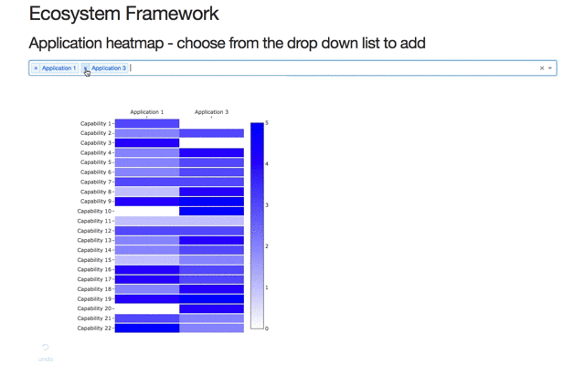

# Ecosystem Framework

This is an anonymised version of a tool using IBM Cloud, python and Dash from plot.ly to dig into the capabilities of different AI focused software.

This repository contains code referred to in a series of blog posts on [Medium](https://medium.com/@mandieq).

* [Me and the problem I'm solving](https://medium.com/@mandieq/me-and-the-problem-im-solving-13d3993b016b)
* [Digging into data with python and Dash — my first app](https://medium.com/@mandieq/digging-into-data-with-python-and-dash-my-first-app-b07bf4988200)

